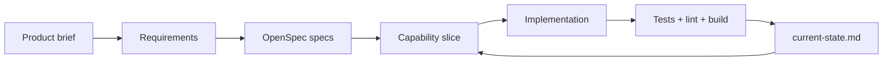

# visuals-mermaid

Conventions for Mermaid diagrams in this Slidev deck.

## Why Mermaid (not images)

- Edits live in Markdown — no asset re-export.
- Renders crisp at any zoom / PDF scale.
- Theme follows the slide (light/dark).

## Syntax in a Slidev slide

````markdown

````

Slidev also supports `{ scale: 0.7 }`-style options after the `mermaid` tag:

````markdown

````

Use `scale` to keep dense diagrams inside the slide canvas.

## Hard syntax rules (avoid common parser breakage)

1. **No spaces in node IDs.** Use `camelCase`, `PascalCase`, or `snake_case`.

   ```
   Good: UserService, user_service, userAuth
   Bad:  User Service, user auth
   ```

2. **Quote labels with special chars** (parentheses, colons, brackets).

   ```
   Good: A["Process (main)"], B["Step 1: Init"]
   Bad:  A[Process (main)] -- ( ) parsed as shape syntax
   ```

3. **Quote edge labels with parentheses / brackets.**

   ```
   Good: A -->|"O(1) lookup"| B
   Bad:  A -->|O(1) lookup| B
   ```

4. **Avoid reserved keywords as node IDs:** `end`, `subgraph`, `graph`,
   `flowchart`. Use `endNode`, `processEnd`, etc.

5. **Subgraphs need explicit IDs with bracketed labels:**

   ```
   subgraph auth [Authentication Flow]
     ...
   end
   ```

6. **No HTML entities** (`&lt;`, `&gt;`) — they render literally. Use plain
   text or unicode.

7. **Don't apply explicit colors / styles.** Theme switches between light/dark
   in Slidev preview; hardcoded colors break dark mode.

   ```
   Bad: style A fill:#fff
   Bad: classDef myClass fill:white
   ```

8. **No `click` handlers.** Disabled for security in this context.

## Diagram size guidance

| Slide density        | Max nodes / edges | Recommended `scale` |
| -------------------- | ----------------- | ------------------- |
| Few words around     | 6 / 6             | 1.0                 |
| Title + diagram only | 12 / 14           | 0.85                |
| Diagram is the slide | 18 / 22           | 0.7                 |

If you exceed 18 nodes, split into 2 slides or use a hierarchical subgraph.

## Useful diagram types

- `flowchart LR/TD` — process / dataflow.
- `sequenceDiagram` — actor interactions, prompt → tool → tool → answer flows.
- `stateDiagram-v2` — agent loop states.
- `classDiagram` — domain model / capability relationships.
- `gantt` — workshop schedule.

## Definition of done

- Diagram renders in `npm run dev` and `npm run build`.
- Looks readable at the slide's zoom (don't rely on the user manual-zooming).
- All node IDs follow the rules above.
