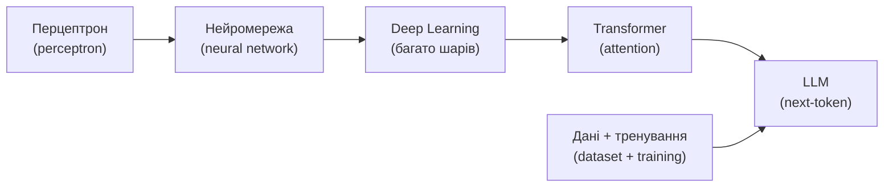
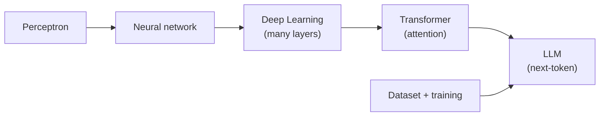

# Від нейрона до LLM — коротко

- **Transformer** + механізм уваги (attention) — основа сучасних моделей
- Модель навчається на величезному **датасеті (dataset)** коду й тексту
- **Thinking vs non-thinking**: «reasoning»-моделі витрачають більше токенів на роздуми → краще на складних задачах, дорожче

# From neuron to LLM — briefly

- **Transformer** + attention is the backbone of modern models
- The model learns from a huge **dataset** of code and text
- **Thinking vs non-thinking**: "reasoning" models spend more tokens thinking → better on hard tasks, more expensive

<!--
Speaker note: ~2 хв. НЕ читати лекцію з ML. Один слайд-карта, щоб усі мали
спільні слова: transformer, dataset, reasoning. Акцент на thinking vs
non-thinking — це впливає на вибір моделі й вартість далі.
Time cue: ~2 хв
Mapping: PPTX slides 15-23 (condensed)
-->
