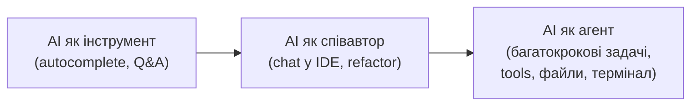
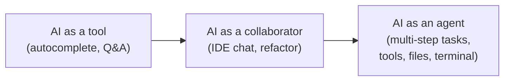

# Еволюція ролі AI у SDLC

# Evolution of AI's role in the SDLC

<v-clicks>

- **Інструмент**: підказки, автодоповнення — людина робить усе сама**Tool**: hints, autocomplete — the human does everything
- **Співавтор (collaborator)**: діалог у IDE, генерація шматків, пояснення коду**Collaborator**: IDE dialogue, generating chunks, explaining code
- **Агент (agent)**: сам планує, редагує файли, запускає команди, ітерує — **під наглядом людини****Agent**: plans, edits files, runs commands, iterates — **under human supervision**
- Сьогодні фокус курсу — **agentic-розробка** з контролем якості, безпеки й вартостіThe course focus today is **agentic development** with control over quality, security, and cost

</v-clicks>

<!--
Speaker note: ~1.5 хв. Це наскрізна теза курсу. «AI as agent» != автономія без
людини — human-in-the-loop. До цієї схеми повертатимемося.
Time cue: ~1.5 хв
Mapping: plan.md Lesson 1 (тема "from AI as tool → collaborator → agent")
-->
