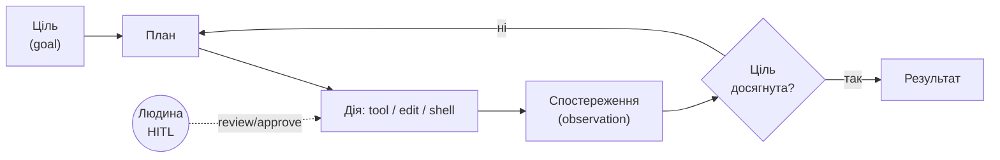
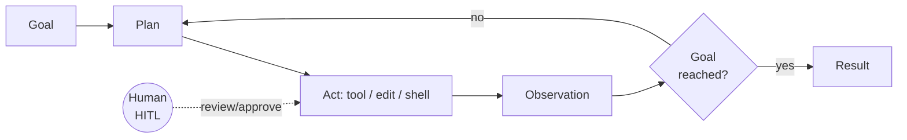

# Як працює сучасний агент

- Цикл: **план → дія → спостереження → корекція**, з доступом до файлів, терміналу, інструментів
- **Human-in-the-loop (HITL):** людина задає ціль, рев'ює зміни, апрувить ризиковані дії
- Автономність — це **спектр**, а не вмикач: більше довіри = більше перевірки

# How a modern agent works

- The loop: **plan → act → observe → correct**, with access to files, terminal, tools
- **Human-in-the-loop (HITL):** the human sets the goal, reviews diffs, approves risky actions
- Autonomy is a **spectrum**, not a switch: more trust = more verification

<!--
Speaker note: ~2 хв. Demystify «агента»: це цикл plan-act-observe, не магія.
Підкреслити HITL — ми не прибираємо людину, ми її піднімаємо на рівень
рев'ю/апрувів. Простий vs сучасний агент (PPTX 40-41) = додані інструменти.
Time cue: ~2 хв
Mapping: PPTX slides 40-42
-->
